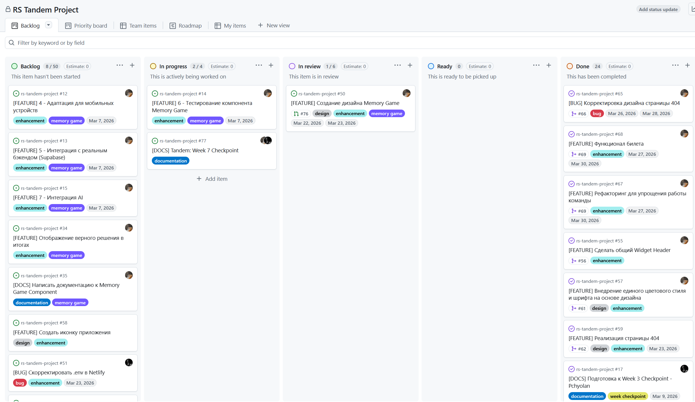

# RS Tandem Project

## 📖 Description
A tiny web project fueled by coffee and optimism ☕️
We write code, occasionally debug, and mostly survive stage 2.  

## 🌱 Deploy
[Deploy Link](https://tranquil-froyo-550c45.netlify.app/)

## 🌟 Team
- Pchyolan – [GitHub](https://github.com/pchyolan) - [Дневники](./development-notes/Pchyolan)
- Anna Demyanovich – [GitHub](https://github.com/thefoxtale) - [Дневники](./development-notes/theFoxTale)

## ⚙️ Технологический стек
- **Язык:** TypeScript
- **Сборщик:** Vite
- **Стили:** SCSS
- **Тестирование:** Vitest + jsdom
- **Линтер/форматтер:** ESLint, Prettier, Stylelint
- **База данных/аутентификация:** Supabase

## 🤹‍♀️ Kanban-доска разработки проекта
Все задачи, связанные с разработкой и развитием проекта, занесены на Kanban-доску - [ссылка](https://github.com/users/Pchyolan/projects/1/views/1).


## 📝 Записи встреч команды
Иногда мы встречаемся командой для обсуждения нашего проекта и ведём дневниковые записи наших встреч. Всё, что есть, лежит [тут](./docs/meeting-notes/index.md)

## Интересные PR с Code Review
На самом деле мы чаще всего обсуждали их на встречах голосом (так просто быстрее, а времени нам не хватало катастрофически), но кое-что есть в виде записей. Например:
- [Пример №1](./development-notes/Pchyolan/Pchyolan-2026-03-17.md)
- [Пример №2](./development-notes/Pchyolan/Pchyolan-2026-03-30.md)
- [Пример №3](./development-notes/Pchyolan/Pchyolan-2026-03-31.md)
- [Пример №4](https://github.com/Pchyolan/rs-tandem-project/pull/46)

## 🚀 Запуск проекта для разработчиков
Для запуска проекта требуется Node миниум 20-ой версии.

1. Клонирование репозитория
```bash

git clone https://github.com/Pchyolan/rs-tandem-project.git
cd rs-tandem-project
```

2. Установка зависимостей
```bash

npm install
```

3. Настройка переменных окружения

Создайте файл .env в корне проекта со следующим содержимым (замените значения на свои из Supabase):
```env

VITE_DEFAULT_LANGUAGE=en   # или ru
```

4. Запуск в режиме разработки
```bash

npm run dev
```

После запуска приложение будет доступно по адресу http://localhost:3000 (порт может измениться, если 3000 занят).

## 🛠️ Хуки Husky
Проект использует Husky и lint-staged:
- При коммите автоматически запускается lint-staged, который проверяет и форматирует изменённые файлы.
- При пуше запускается проверка типов и сборка проекта (см. .husky/pre-push).

## 💻 Команды для разработки

| Команда                   | Описание                                                   |
|---------------------------|------------------------------------------------------------|
| `npm run dev`             | **Запуск дев-сервера Vite с горячей заменой модулей**      |
| `npm run build`           | Сборка проекта                                             |
| `npm run preview`         | Локальный просмотр собранной версии (из папки dist)        |
| `npm run type-check`      | **Проверка типов TypeScript без сборки**                   |
| `npm run lint`            | **Проверка ESLint с автоматическим исправлением ошибок**   |
| `npm run lint:check`      | Только проверка ESLint (без исправлений)                   |
| `npm run format`          | **Форматирование кода через Prettier**                     |
| `npm run format:check`    | Проверка форматирования (без записи)                       |
| `npm run lint:styles`     | 	Проверка SCSS/CSS с помощью Stylelint                     |
| `npm run lint:styles:fix` | 	**Проверка и автоматическое исправление стилей SCSS/CSS** |
| `npm run test`            | Запуск тестов Vitest                                       |
| `npm run test:ui`         | Запуск тестов с UI-интерфейсом                             |
| `npm run test:coverage`   | Запуск тестов с отчётом о покрытии                         |
| `npm run check-all`       | Полная проверка: типы, линтер, формат, тесты (для CI)      |

# 🤿 Правила работы с ветками
Ветки разработки в проекте сгруппированы по папкам:
- notes - для дневников, записей встреч и документации
- feature - для новых фич и разработок
- fix - для правки багов


