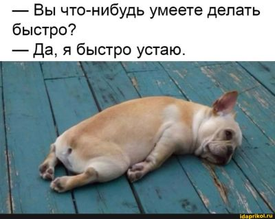
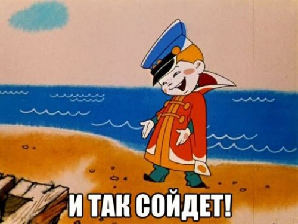
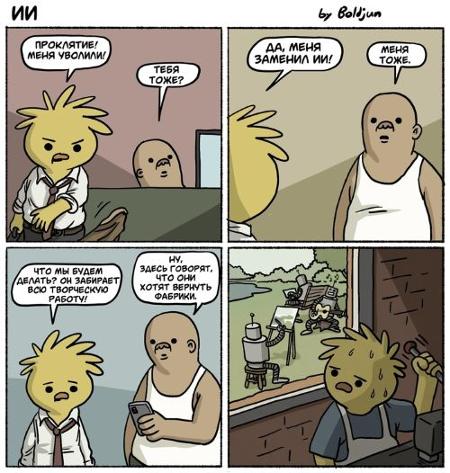

## Дата: 28 марта 2026 года

### Что было сделано
<!-- Опиши, над какими компонентами/фичами работал сегодня. 
     Какие задачи из списка продвинулись? 
     Пример: "Создал компонент Header с кнопками навигации, настроил переключение языка через Observable."
     Пример: "Настроил роутер, добавил страницы Login и API Test."
     Если есть связанные Pull Request'ы или Issue, укажи ссылки: 
     - PR: [#12](https://github.com/Pchyolan/rs-tandem-project/pull/12)
     - Issue: [#5](https://github.com/Pchyolan/rs-tandem-project/issues/5)
-->
Начала делать форму регистрации и входа в приложение. Как обычно думала, что сделаю быстро,а просидела два дня))
- PR: [#71](https://github.com/Pchyolan/rs-tandem-project/pull/71)
- Issue: [#60](https://github.com/Pchyolan/rs-tandem-project/issues/60)

По итогу за два дня:
- **Реализовала макет формы регистрации** (`home-page`), пока без функционала, чтобы просто была сама форма.

- **Добавила разные иконки в `qsvg-icons.ts`**. Будут в одном стиле, взяла все из одного набора.
    - для формы логина, которую делала
    - под страницу 404 (поправила существующую)
    - под рефакторинг своего виджета, тоже потом пригодятся.

- **Переписала `__mixins.scss`** – теперь тут есть базовый стиль для округлого элемента, и он используется для создания кнопок и полей ввода.

### Проблемы и Решения (или попытки)
<!-- С какими трудностями столкнулся? Опиши ошибки, непонимание, баги. 
     Пример: "Не работал hashchange, пришлось разбираться с инициализацией роутера."
     Пример: "TypeScript ругался на enum из-за опции erasableSyntaxOnly, пришлось заменить на объект."
-->
- Пришла мне в голову классная мысль сделать картинку персонажа анимированной - чтобы он махал рукой, вроде как красиво будет и дружелюбно. Оказалось, что это не так просто как кажется... 
  - Сначала оказалось, что ChatGPT кривовато вырезал фон с картинки с персонажем, там были прозрачные места внутри самого персонажа, которых не должно было быть. Пришлось вооружаться Photoshop и его штампиками, чтобы это исправить.
  - Потом я перебрала 6 разных нейронок, чтобы сгенерировать это движение для готовой картинки мозга. Никто не мог сделать нормально, выходила какая-то смешная или ужасная ерунда)) В итоге неплохо справился [Pika](https://pika.art/), но он не смог сделать зацикленную анимацию и почему-то упорно заменял фон на радугу в чёрно-серых цветах.
  - Перебрала ещё кучу нейронок чтобы сделать фон прозрачным. Опять никто не мог с ним справится, пришлось сделать в 2 этапа: сначала [Ease Mate AI](https://www.easemate.ai) поменял готическую радугу на белый фон, потом [CutOut](https://www.cutout.pro) поменял белый фон на прозрачный.

- Когда я вставила с большим трудом сгенерированное видео на форму, оно отобразилось как картинка :)
  

Оказалось, что на видео встроена пустая звуковая дорожка, и никакие muted и volume:0 на неё не действуют. Красота)) Пришлось лезть в DeepSeek и спрашивать у него советов. Он помог найти бесплатный пакет для Windows и подсказал консольную команду которая поможет вырезать пустое аудио. И это помогло =) Спасибо братьям - китайцам)

- Потом оказалось, что в процессе шатания по нейронкам с фона видео пропали все звездочки, что было обидно. Пришлось снова лезть в Photoshop, создать картинку-фон и подкладывать её под видео. В общем, мы точно не ищем легких путей)) Убить 5 часов на анимированную картинку, когда не успеваешь закончить проект - это сильно))) Но было весело и вышло классно, я довольна.

- Нашла симпатичный [пакет SVG-иконок](https://www.svgrepo.com/collection/kalai-oval-interface-icons), заменила все иконки на единообразные - пусть пока будут из готового пака, если не получится сгенерировать у Крис.
- Переписала файлик с миксинами, добавила туда общий миксин для любых округлых элементов и миксин для инпутов.
- Начала делать поля для ввода данных. Опять проблема с display: none и opacity для анимации появления. Надо усложнять структуру DOM, чтобы корректно работало отображение скрытых блоков, но сегодня я уже без сил - опять 3 часа ночи. Оставлю на завтра.

### Мысли / Планы
<!-- Какие идеи возникли? Что планируешь делать дальше? 
     Пример: "Подумал, что стоит добавить защиту маршрутов через Observable."
     Пример: "Завтра начну делать страницу API Test с полями для email и пароля."
     Если планируешь создать Issue для задачи, укажи ссылку на него (можно создать заранее):
     - Issue: [#8](https://github.com/Pchyolan/rs-tandem-project/issues/8)
-->
- Надо как-то понять как будут проходить защиты и есть ли у нас шанс показать хоть что-то. Пробовала сегодня изучить чат (но помер Telegram), посмотреть видео с созвонов на YouTube и опять перечитать доки. Только запуталась, слишком сумбурно. У меня не хватает времени и сил на постоянное преодоление этой сумбурности... Очень выматывает. Всё1-таки решение забить на чек-поинты и посвятить вместо этого время коду было правильным. Я хотя бы перестала нервничать и начала нормально писать код. Жаль,что на настройку себя на работу ушло так много времени( Но всё равно есть переживания, что защититься не получится вообще.

### Затраченное время
<!-- Укажи примерное количество часов, потраченных сегодня на проект. Например: 5 часов -->
Примерно 20 часов за 2 дня в сумме.

### Использование AI (если применимо)
<!-- Отметь, использовал ли сегодня AI-инструменты (ChatGPT, Copilot, Kiro) и для каких задач. 
     Например: "Использовал ChatGPT для генерации шаблона PR." или "Copilot помог написать базовую структуру компонента."
     Это важно для прозрачности и оценки личного вклада. -->
Да, иначе наше приложение осталось бы без радостного главного персонажа. Нейронки целой толпой его и создали) Напоминает известный мем: я пишу код, а нейронки генерируют мне картинки и дизайны))

